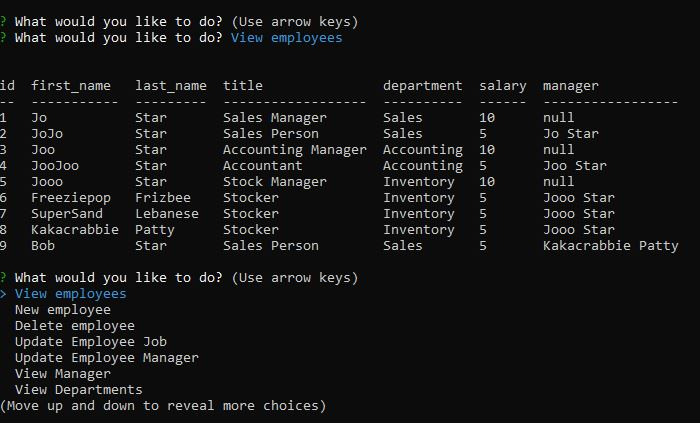

# Employee-Tracker

## Description

* Employee Tracker is a utilitarian that provides employers a simple and effective means to organize their employees.

## Usage

* Simply clone the repository and initiate from the command line

## Credits:

* Node Express
* MySql
* Various documentation accessed via google

## Questions:
  
For additional information visit my GitHub page:
* [GitHub Profile](https://github.com/bg00924)

For questions please send me an email at:
* bg00924@gmail.com

## Preview

